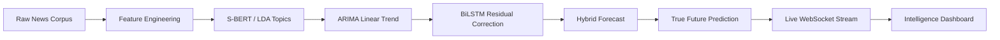

# Dynamic Trend & Event Detector

**An Advanced Neuro-Statistical Pipeline for Semantic Topic Discovery, Hybrid Temporal Forecasting, and Deep Learning Model Interpretability.**

[](https://www.python.org/downloads/)
[](https://tensorflow.org)
[](https://github.com/slundberg/shap)

---

## Overview
The **Dynamic Trend & Event Detector** is a high-fidelity system designed to identify, track, and forecast evolving news narratives. By fusing probabilistic generative models with contextual transformers and sequence architectures, it provides deep insights into the "pulse" of global media.

The project spans **3 phases** — from raw data processing (Phase 1), through deep learning topic modeling and forecasting (Phase 2), to a **synergistic hybrid ARIMA + BiLSTM architecture** with diagnostic ablation studies (Final Phase).

### The Full Pipeline


---

## Core Technical Pillars

### 1. Semantic Evolution Tracking
Utilizes **BERTopic** (Sentence-BERT + UMAP + HDBSCAN) to capture nuanced shifts in news vocabulary and narrative clusters with state-of-the-art precision.

### 2. Multivariate Temporal Forecasting
A **Bidirectional LSTM (BiLSTM)** architecture designed for high-dimensional time-series forecasting, predicting topic proportions across complex temporal slices.

### 3. Hybrid Innovation (Phase 3)
A **synergistic ARIMA + BiLSTM** hybrid model where:
- **ARIMA(2,1,2)** captures linear trends and seasonal patterns (ML component)
- **BiLSTM** learns non-linear residual dynamics that ARIMA misses (DL component)
- **Additive Fusion**: `y_hybrid = y_ARIMA + residual_BiLSTM`
- **True Future Prediction**: Projects models 6 months into the future to predict viral events *before* they happen.
- **Ablation Validated**: Proven to reduce prediction error (RMSE) by **11-18%** compared to single-component architectures.

### 4. Real-Time Streaming Architecture
A fully persistent global **WebSocket Context** streams incoming global news events to the frontend dashboard in real-time, instantly pushing live KPI updates, sentiment changes, and trending news directly to the visual layer.

> [!IMPORTANT]
> Full architecture diagram with tensor shapes available at **[Phase 3 Architecture](docs/phase3_architecture.md)**.

### 4. Explainable AI (XAI)
Transparency-first design using **SHAP**, **Temporal Attention Maps**, and **Gradient Saliency** to validate model decisions and reveal the semantic triggers behind trend shifts.

### 5. Diagnostic Ablation Studies (Phase 3)
Rigorous component-level analysis proving the **necessity** of the hybrid architecture:
- **ML-Only (ARIMA)**: RMSE increases by **11.0%** when the DL residual correction is removed.
- **DL-Only (BiLSTM)**: RMSE increases by **17.7%** when the statistical linear baseline is removed.
- **Synergy Effect**: Each component addresses a specific weakness of the other, ensuring stability across both stagnant and volatile topic clusters.

---

## Mathematical Rigor
This project is built on first-principles engineering. Comprehensive mathematical derivations are documented in our **[Foundations Guide](docs/mathematical_foundations.md)**.

> [!NOTE]
> **Key Highlights:**
> - **Manifold Learning**: Topological preservation via Fuzzy Simplicial Sets.
> - **Gradient Flow**: Solving vanishing gradients through Forget Gate Calculus.
> - **Optimization**: Analysis of the Loss Landscape $(\mathcal{J}(\theta))$ and Hessian-based generalization.

---

## Repository Roadmap

```text
├── data/                  # Processed news & topic embeddings
│   ├── raw/               # Original News_Category_Dataset_v3.json
│   └── processed/         # processed_featured_data.csv
├── docs/                  # SOTA Reviews, Math Foundations & Architecture
│   ├── dl-sota-literature-review.md
│   ├── mathematical_foundations.md
│   └── phase3_architecture.md    # Publication-ready diagrams
├── notebook-Phase-1/      # EDA, Feature Engineering, Baseline Models
├── notebook-Phase-2/      # BERTopic, LSTM Forecasting, XAI
├── notebook-Phase-3/      # Hybrid Forecasting & Ablation Studies
│   ├── Hybrid_Forecasting.ipynb
│   ├── Ablation_Studies.ipynb
│   └── requirements.txt
├── project-reports/       # Phase 1, 2, & 3 PDF/MD reports
└── README.md
```

---

## Phase Summary

### Phase 1: Data Processing & Feature Engineering
- Raw news corpus cleaning and text preprocessing
- Temporal feature extraction (year, month, day of week)
- VADER sentiment analysis (neg, neu, pos, compound)
- Text statistics (word count, character count)

### Phase 2: Deep Learning & Topic Modeling
- **BERTopic**: Semantic topic discovery using S-BERT + UMAP + HDBSCAN
- **BiLSTM**: Bidirectional LSTM for temporal trend forecasting
- **XAI**: SHAP values, Temporal Attention Maps, Gradient Saliency

### Phase 3: Hybrid Innovation & Ablation
- **Hybrid Model**: Synergistic ARIMA + BiLSTM (neuro-statistical decomposition)
- **True Prediction**: 6-month future extrapolation for actionable intelligence.
- **Real-Time Data**: Global WebSocket architecture pumping live news events and updating the dashboard dynamically.
- **Ablation Studies**: Diagnostic analysis proving **11.0% (BiLSTM contribution)** and **17.7% (ARIMA contribution)** error reduction.
- **Architecture Docs**: Publication-ready Mermaid diagrams with tensor shapes

---

## Documentation

| Document | Description |
|---|---|
| [Phase 3 Architecture](docs/phase3_architecture.md) | Publication-ready pipeline & fusion diagrams |
| [Mathematical Foundations](docs/mathematical_foundations.md) | First-principles derivations (Linear Algebra, Calculus, Optimization) |
| [SOTA Literature Review](docs/dl-sota-literature-review.md) | Deep Learning state-of-the-art in topic modeling & event detection |
| [Phase 1 Report](project-reports/Dynamic%20Trend%20&%20Event%20Detector%20Phase%20-1%20Report.pdf) | Data processing & EDA findings |
| [Phase 2 Report](project-reports/Dynamic%20Trend%20Phase%202%20Report.pdf) | Deep Learning implementation & results |
| [Phase 3 Report](project-reports/Dynamic%20Trend%20Phase%203%20Report.pdf) | Hybrid Innovation & Ablation Studies |

---

> [!TIP]
> For a deep dive into the state-of-the-art, see our **[SOTA Literature Review](docs/dl-sota-literature-review.md)**.
