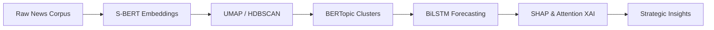

# Dynamic Trend & Event Detector

**An Advanced Pipeline for Semantic Topic Discovery, Temporal Trend Forecasting, and Deep Learning Model Interpretability.**

[](https://www.python.org/downloads/)
[](https://tensorflow.org)
[](https://github.com/slundberg/shap)

---

## Overview
The **Dynamic Trend & Event Detector** is a high-fidelity system designed to identify, track, and forecast evolving news narratives. By fusing probabilistic generative models with contextual transformers and sequence architectures, it provides deep insights into the "pulse" of global media.

### The Pipeline


---

## Core Technical Pillars

### 1. Semantic Evolution Tracking
Utilizes **BERTopic** (Sentence-BERT + UMAP + HDBSCAN) to capture nuanced shifts in news vocabulary and narrative clusters with state-of-the-art precision.

### 2. Multivariate Temporal Forecasting
A **Bidirectional LSTM (BiLSTM)** architecture designed for high-dimensional time-series forecasting, predicting topic proportions across complex temporal slices.

### 3. Explainable AI (XAI)
Transparency-first design using **SHAP**, **Temporal Attention Maps**, and **Gradient Saliency** to validate model decisions and reveal the semantic triggers behind trend shifts.

---

## Mathematical Rigor
This project is built on first-principles engineering. Comprehensive mathematical derivations are documented in our **[Foundations Guide](docs/mathematical_foundations.md)**.

> [!NOTE]
> **Key Highlights:**
> - **Manifold Learning**: Topological preservation via Fuzzy Simplicial Sets.
> - **Gradient Flow**: Solving vanishing gradients through Forget Gate Calculus.
> - **Optimization**: Analysis of the Loss Landscape $(\mathcal{J}(\theta))$ and Hessian-based generalization.

---

## Repository Roadmap

```text
├── backend/               # FastAPI Analytics Service
├── frontend/              # Next.js Intelligence Dashboard
├── data/                  # Processed news & topic embeddings
├── docs/                  # SOTA Reviews & Mathematical Foundations
├── models/                # Production-ready weights (.h5, .safetensors)
├── notebook-Phase-2/      # Forecasting, Topic Modeling, & XAI Suites
└── start.sh               # Unified Launch Script
```

---

## 🚀 Intelligence Platform

The project now features a premium, full-stack intelligence platform for real-time visualization and forecasting.

### Key Features
- **Dashboard**: High-level KPIs and thematic evolution charts.
- **Predictive Analytics**: Interactive LSTM forecasts for emerging themes.
- **Event Explorer**: Deep dive into individual news reports with sentiment tracking.
- **Glassmorphic UI**: State-of-the-art dark mode design for optimal data clarity.

### Quick Start
To launch the entire platform (Backend + Frontend):
```bash
chmod +x start.sh
./start.sh
```
- **Dashboard**: `http://localhost:3000`
- **Analytics API**: `http://localhost:8000`

---

---

> [!TIP]
> For a deep dive into the state-of-the-art, see our **[SOTA Literature Review](docs/dl-sota-literature-review.md)**.
