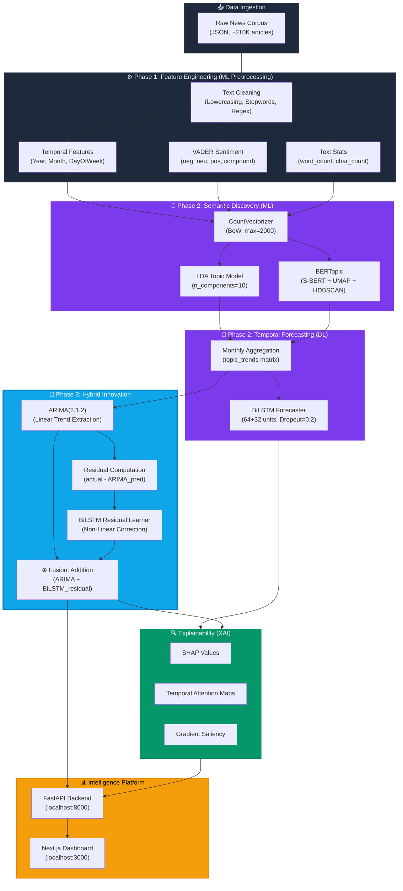

# Phase 3: System Architecture — Publication-Ready

> **Dynamic Trend & Event Detector**
> A Neuro-Statistical Pipeline for Semantic Topic Discovery, Temporal Trend Forecasting, and Model Interpretability.

---

## 1. High-Level Pipeline Architecture

---

## 2. Hybrid Fusion Mechanism (Detailed)

This diagram shows the exact mathematical fusion between the ML and DL components at the tensor level.

```mermaid
graph LR
    subgraph ML_COMPONENT["ML Component: ARIMA(2,1,2)"]
        A1["Input: Topic Series<br/>Shape: (T,)"] --> A2["Differencing (d=1)<br/>Stationarity Transform"]
        A2 --> A3["AR(2) + MA(2)<br/>Linear Estimation"]
        A3 --> A4["ŷ_linear<br/>Shape: (T_test,)"]
    end

    subgraph RESIDUAL["Residual Bridge"]
        A4 --> R1["ε = y_actual - ŷ_linear<br/>Shape: (T_train,)"]
        R1 --> R2["MinMaxScaler(-1, 1)<br/>Normalization"]
        R2 --> R3["Sliding Window<br/>Shape: (N, 5, 1)"]
    end

    subgraph DL_COMPONENT["DL Component: BiLSTM"]
        R3 --> D1["Bi-LSTM Layer 1<br/>(64 units → 128 dim)"]
        D1 --> D2["Dropout(0.2)"]
        D2 --> D3["Bi-LSTM Layer 2<br/>(32 units → 64 dim)"]
        D3 --> D4["Dropout(0.2)"]
        D4 --> D5["Dense(16, ReLU)"]
        D5 --> D6["Dense(1, Linear)<br/>ε̂_predicted"]
    end

    subgraph FUSION["⊕ Additive Fusion"]
        A4 --> F1["ŷ_hybrid = ŷ_linear + ε̂_predicted"]
        D6 --> F1
        F1 --> F2["Final Forecast<br/>Shape: (T_test,)"]
    end

    style ML_COMPONENT fill:#f59e0b,stroke:#d97706,color:#000
    style DL_COMPONENT fill:#8b5cf6,stroke:#7c3aed,color:#fff
    style RESIDUAL fill:#64748b,stroke:#475569,color:#fff
    style FUSION fill:#22d3ee,stroke:#06b6d4,color:#000
```

---

## 3. Tensor Shape Flow

| Stage | Component | Input Shape | Output Shape | Description |
|-------|-----------|-------------|--------------|-------------|
| 1 | Raw Data | `(~210000, 17)` | — | CSV with features |
| 2 | CountVectorizer | `(N, )` text | `(N, 2000)` sparse | Bag-of-Words |
| 3 | LDA | `(N, 2000)` | `(N, 10)` | Topic distributions |
| 4 | Monthly Agg | `(N, 10)` | `(T, 10)` | T = number of months |
| 5 | ARIMA | `(T_train, )` | `(T_test, )` | Linear forecast |
| 6 | Residuals | `(T_train, )` | `(T_train, )` | Non-linear signal |
| 7 | Windowing | `(T_train, )` | `(N_seq, 5, 1)` | Sliding window = 5 |
| 8 | BiLSTM L1 | `(batch, 5, 1)` | `(batch, 5, 128)` | Bidirectional 64×2 |
| 9 | BiLSTM L2 | `(batch, 5, 128)` | `(batch, 64)` | Bidirectional 32×2 |
| 10 | Dense | `(batch, 64)` | `(batch, 1)` | Residual prediction |
| 11 | **Fusion** | `(T_test,) + (T_test,)` | `(T_test, )` | **ŷ = ARIMA + BiLSTM** |

---

## 4. Notation Key

| Symbol | Meaning |
|--------|---------|
| `⊕` | Additive fusion (element-wise addition) |
| `ŷ_linear` | ARIMA's linear trend prediction |
| `ε` | Residual error = actual − ARIMA prediction |
| `ε̂` | BiLSTM's predicted residual correction |
| `T` | Total number of time steps (months) |
| `N` | Number of documents |
| `d` | Differencing order for stationarity |

---

> [!NOTE]
> This architecture follows the **Neuro-Statistical Decomposition** paradigm:
> the statistical model (ARIMA) handles the *mechanism of linear trend*,
> while the neural model (BiLSTM) handles the *mechanism of non-linear dynamics*.
> The additive fusion preserves interpretability while maximizing predictive power.
